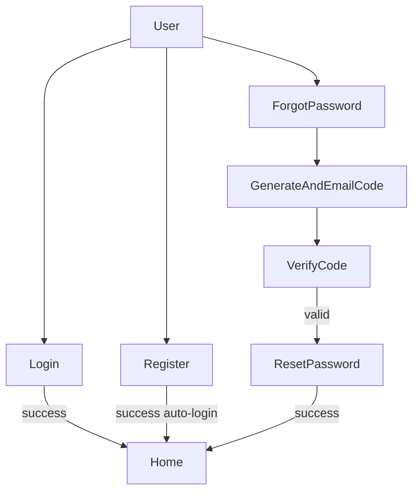

# Auth with Email & Verification Code (ASP.NET Core MVC)

## 1. Confirm current Identity setup

- **Goal**: Ensure you already have ASP.NET Identity wired correctly and an `ApplicationUser` with email support.
- **Files to check**:
  - `[Program.cs](Program.cs)` or `[Startup.cs](Startup.cs)` – look for `AddDbContext`, `AddIdentity`, `UseAuthentication`, `UseAuthorization`.
  - `[Areas/Identity/](Areas/Identity/)` or `[Data/ApplicationDbContext.cs](Data/ApplicationDbContext.cs)` – confirm `IdentityDbContext<ApplicationUser>`.
- **Code expectations** (already existing, just verify):

```csharp
// In Program.cs
builder.Services.AddDefaultIdentity<ApplicationUser>(options =>
{
    options.SignIn.RequireConfirmedAccount = true; // recommended
})
.AddEntityFrameworkStores<ApplicationDbContext>();

var app = builder.Build();
app.UseAuthentication();
app.UseAuthorization();
```

## 2. Configure email sending service

- **Goal**: Set up a reusable `IEmailSender` so you can send the verification code for forgot password.
- **Packages (choose one approach)**:
  - **Simple SMTP (built-in)**: no extra package; use `System.Net.Mail`.
  - **Recommended**: `MailKit` (`MailKit` NuGet) or `FluentEmail.MailKit` for more robust email.
- **Steps**:
  - Add SMTP settings to `[appsettings.json](appsettings.json)`:

```json
"Smtp": {
  "Host": "smtp.yourprovider.com",
  "Port": 587,
  "EnableSsl": true,
  "UserName": "no-reply@yourdomain.com",
  "Password": "YourStrongPassword"
}
```

- Create an `EmailSettings` class in `[Models/EmailSettings.cs](Models/EmailSettings.cs)`:

```csharp
public class EmailSettings
{
    public string Host { get; set; } = string.Empty;
    public int Port { get; set; }
    public bool EnableSsl { get; set; }
    public string UserName { get; set; } = string.Empty;
    public string Password { get; set; } = string.Empty;
}
```

- Implement `IEmailSender` in `[Services/SmtpEmailSender.cs](Services/SmtpEmailSender.cs)`:

```csharp
public class SmtpEmailSender : IEmailSender
{
    private readonly EmailSettings _settings;

    public SmtpEmailSender(IOptions<EmailSettings> options)
    {
        _settings = options.Value;
    }

    public async Task SendEmailAsync(string email, string subject, string htmlMessage)
    {
        using var client = new SmtpClient(_settings.Host)
        {
            Port = _settings.Port,
            EnableSsl = _settings.EnableSsl,
            Credentials = new NetworkCredential(_settings.UserName, _settings.Password)
        };

        var mail = new MailMessage
        {
            From = new MailAddress(_settings.UserName),
            Subject = subject,
            Body = htmlMessage,
            IsBodyHtml = true
        };
        mail.To.Add(email);

        await client.SendMailAsync(mail);
    }
}
```

- Register configuration and service in `Program.cs`:

```csharp
builder.Services.Configure<EmailSettings>(builder.Configuration.GetSection("Smtp"));
builder.Services.AddTransient<IEmailSender, SmtpEmailSender>();
```

## 3. Define view models for Login, Register, Forgot Password, Verification, and Reset

- **Goal**: Strongly-typed models for each form.
- **File**: `[Models/AuthViewModels.cs](Models/AuthViewModels.cs)` (or separate files per model).

```csharp
public class RegisterViewModel
{
    [Required, EmailAddress]
    public string Email { get; set; } = string.Empty;

    [Required, DataType(DataType.Password)]
    public string Password { get; set; } = string.Empty;

    [DataType(DataType.Password), Compare("Password")]
    public string ConfirmPassword { get; set; } = string.Empty;
}

public class LoginViewModel
{
    [Required, EmailAddress]
    public string Email { get; set; } = string.Empty;

    [Required, DataType(DataType.Password)]
    public string Password { get; set; } = string.Empty;

    public bool RememberMe { get; set; }
}

public class ForgotPasswordViewModel
{
    [Required, EmailAddress]
    public string Email { get; set; } = string.Empty;
}

public class VerifyCodeViewModel
{
    [Required, EmailAddress]
    public string Email { get; set; } = string.Empty;

    [Required]
    public string Code { get; set; } = string.Empty;
}

public class ResetPasswordViewModel
{
    [Required, EmailAddress]
    public string Email { get; set; } = string.Empty;

    [Required]
    public string Code { get; set; } = string.Empty;

    [Required, DataType(DataType.Password)]
    public string NewPassword { get; set; } = string.Empty;

    [DataType(DataType.Password), Compare("NewPassword")]
    public string ConfirmPassword { get; set; } = string.Empty;
}
```

## 4. Model for storing verification/reset code

- **Goal**: Persist a one-time verification code with expiry for secure password reset.
- **Best practice**: Store hashed or random tokens with expiry; do not reuse codes and expire them quickly.
- **Entity**: Add `PasswordResetCode` to your Identity DbContext in `[Models/PasswordResetCode.cs](Models/PasswordResetCode.cs)`:

```csharp
public class PasswordResetCode
{
    public int Id { get; set; }
    public string UserId { get; set; } = string.Empty;
    public string CodeHash { get; set; } = string.Empty;
    public DateTime ExpiresAtUtc { get; set; }
    public bool Used { get; set; }
}
```

- **DbContext** (in `[Data/ApplicationDbContext.cs](Data/ApplicationDbContext.cs)`):

```csharp
public DbSet<PasswordResetCode> PasswordResetCodes { get; set; }
```

- **Code generation helper** (e.g., in `[Services/PasswordResetService.cs](Services/PasswordResetService.cs)`):

```csharp
public static string GenerateNumericCode(int length = 6)
{
    var rnd = RandomNumberGenerator.Create();
    var bytes = new byte[length];
    rnd.GetBytes(bytes);
    var sb = new StringBuilder(length);
    foreach (var b in bytes)
        sb.Append((b % 10).ToString());
    return sb.ToString();
}

public static string HashCode(string code)
{
    using var sha256 = SHA256.Create();
    var bytes = sha256.ComputeHash(Encoding.UTF8.GetBytes(code));
    return Convert.ToBase64String(bytes);
}
```

## 5. Account controller actions (Login, Register, Logout)

- **Goal**: Implement or adjust a central `AccountController` using Identity managers.
- **File**: `[Controllers/AccountController.cs](Controllers/AccountController.cs)`.
- **Constructor injection**:

```csharp
public class AccountController : Controller
{
    private readonly UserManager<ApplicationUser> _userManager;
    private readonly SignInManager<ApplicationUser> _signInManager;

    public AccountController(UserManager<ApplicationUser> userManager,
                             SignInManager<ApplicationUser> signInManager)
    {
        _userManager = userManager;
        _signInManager = signInManager;
    }
```

- **Register (GET/POST)**:

```csharp
[HttpGet]
public IActionResult Register() => View();

[HttpPost]
[ValidateAntiForgeryToken]
public async Task<IActionResult> Register(RegisterViewModel model)
{
    if (!ModelState.IsValid) return View(model);

    var user = new ApplicationUser { UserName = model.Email, Email = model.Email };
    var result = await _userManager.CreateAsync(user, model.Password);
    if (result.Succeeded)
    {
        await _signInManager.SignInAsync(user, isPersistent: false);
        return RedirectToAction("Index", "Home");
    }

    foreach (var error in result.Errors)
        ModelState.AddModelError(string.Empty, error.Description);

    return View(model);
}
```

- **Login (GET/POST)**:

```csharp
[HttpGet]
public IActionResult Login(string? returnUrl = null)
{
    ViewData["ReturnUrl"] = returnUrl;
    return View();
}

[HttpPost]
[ValidateAntiForgeryToken]
public async Task<IActionResult> Login(LoginViewModel model, string? returnUrl = null)
{
    if (!ModelState.IsValid) return View(model);

    var result = await _signInManager.PasswordSignInAsync(
        model.Email,
        model.Password,
        model.RememberMe,
        lockoutOnFailure: true
    );

    if (result.Succeeded)
        return RedirectToLocal(returnUrl);

    ModelState.AddModelError(string.Empty, "Invalid login attempt.");
    return View(model);
}

private IActionResult RedirectToLocal(string? returnUrl)
{
    if (!string.IsNullOrEmpty(returnUrl) && Url.IsLocalUrl(returnUrl))
        return Redirect(returnUrl);
    return RedirectToAction("Index", "Home");
}
```

- **Logout**:

```csharp
[HttpPost]
[ValidateAntiForgeryToken]
public async Task<IActionResult> Logout()
{
    await _signInManager.SignOutAsync();
    return RedirectToAction("Index", "Home");
}
```

## 6. Forgot password: generate and email code

- **Goal**: Accept email, generate one-time code, store hashed version, email the code.
- **Controller actions** (in `AccountController`):

```csharp
private readonly ApplicationDbContext _db;
private readonly IEmailSender _emailSender;

public AccountController(UserManager<ApplicationUser> userManager,
                         SignInManager<ApplicationUser> signInManager,
                         ApplicationDbContext db,
                         IEmailSender emailSender)
{
    _userManager = userManager;
    _signInManager = signInManager;
    _db = db;
    _emailSender = emailSender;
}

[HttpGet]
public IActionResult ForgotPassword() => View();

[HttpPost]
[ValidateAntiForgeryToken]
public async Task<IActionResult> ForgotPassword(ForgotPasswordViewModel model)
{
    if (!ModelState.IsValid) return View(model);

    var user = await _userManager.FindByEmailAsync(model.Email);
    if (user == null)
    {
        // Do not reveal if the email exists
        return RedirectToAction(nameof(ForgotPasswordConfirmation));
    }

    var code = PasswordResetService.GenerateNumericCode();
    var codeHash = PasswordResetService.HashCode(code);

    var entity = new PasswordResetCode
    {
        UserId = user.Id,
        CodeHash = codeHash,
        ExpiresAtUtc = DateTime.UtcNow.AddMinutes(10),
        Used = false
    };

    _db.PasswordResetCodes.Add(entity);
    await _db.SaveChangesAsync();

    var subject = "Your password reset code";
    var message = $"Your verification code is: <strong>{code}</strong>. It expires in 10 minutes.";
    await _emailSender.SendEmailAsync(model.Email, subject, message);

    return RedirectToAction(nameof(VerifyCode), new { email = model.Email });
}

public IActionResult ForgotPasswordConfirmation() => View();
```

## 7. Verify code and reset password

- **Goal**: Let user enter the code, verify it against stored hash and expiry, then allow password reset.
- **Controller actions**:

```csharp
[HttpGet]
public IActionResult VerifyCode(string email)
{
    var model = new VerifyCodeViewModel { Email = email };
    return View(model);
}

[HttpPost]
[ValidateAntiForgeryToken]
public async Task<IActionResult> VerifyCode(VerifyCodeViewModel model)
{
    if (!ModelState.IsValid) return View(model);

    var user = await _userManager.FindByEmailAsync(model.Email);
    if (user == null)
    {
        ModelState.AddModelError(string.Empty, "Invalid code.");
        return View(model);
    }

    var codeHash = PasswordResetService.HashCode(model.Code);
    var record = await _db.PasswordResetCodes
        .Where(x => x.UserId == user.Id && !x.Used && x.ExpiresAtUtc > DateTime.UtcNow)
        .OrderByDescending(x => x.Id)
        .FirstOrDefaultAsync();

    if (record == null || record.CodeHash != codeHash)
    {
        ModelState.AddModelError(string.Empty, "Invalid or expired code.");
        return View(model);
    }

    // Mark as used
    record.Used = true;
    await _db.SaveChangesAsync();

    return RedirectToAction(nameof(ResetPassword), new { email = model.Email, code = model.Code });
}

[HttpGet]
public IActionResult ResetPassword(string email, string code)
{
    var model = new ResetPasswordViewModel { Email = email, Code = code };
    return View(model);
}

[HttpPost]
[ValidateAntiForgeryToken]
public async Task<IActionResult> ResetPassword(ResetPasswordViewModel model)
{
    if (!ModelState.IsValid) return View(model);

    var user = await _userManager.FindByEmailAsync(model.Email);
    if (user == null)
    {
        // Do not reveal existence
        return RedirectToAction(nameof(ResetPasswordConfirmation));
    }

    // Use Identity built-in reset token for the actual password change
    var resetToken = await _userManager.GeneratePasswordResetTokenAsync(user);
    var result = await _userManager.ResetPasswordAsync(user, resetToken, model.NewPassword);

    if (result.Succeeded)
        return RedirectToAction(nameof(ResetPasswordConfirmation));

    foreach (var error in result.Errors)
        ModelState.AddModelError(string.Empty, error.Description);

    return View(model);
}

public IActionResult ResetPasswordConfirmation() => View();
```

- **Best practice**: Use your custom numeric code only for user verification, and still use `GeneratePasswordResetTokenAsync`/`ResetPasswordAsync` for the actual password change to keep Identity logic intact.

## 8. Razor views for forms

- **Goal**: Create simple forms for each step using the view models.
- **Files** (under `[Views/Account/](Views/Account/)`):
  - `Login.cshtml`
  - `Register.cshtml`
  - `ForgotPassword.cshtml`
  - `VerifyCode.cshtml`
  - `ResetPassword.cshtml`
- **Example `Login.cshtml` skeleton**:

```cshtml
@model LoginViewModel

<form asp-action="Login" method="post">
    <div asp-validation-summary="All"></div>
    <div>
        <label asp-for="Email"></label>
        <input asp-for="Email" />
        <span asp-validation-for="Email"></span>
    </div>
    <div>
        <label asp-for="Password"></label>
        <input asp-for="Password" />
        <span asp-validation-for="Password"></span>
    </div>
    <div>
        <input asp-for="RememberMe" />
        <label asp-for="RememberMe"></label>
    </div>
    <button type="submit">Login</button>
    <a asp-action="ForgotPassword">Forgot your password?</a>
</form>
```

- Use similar patterns for `Register`, `ForgotPassword`, `VerifyCode`, and `ResetPassword` views with the corresponding models.

## 9. Routes, navigation, and security best practices

- **Goal**: Expose pages correctly and follow security best practices.
- **Routing**:
  - Ensure conventional route (e.g., in `Program.cs`) allows `/Account/Login`, `/Account/Register`.
- **Navigation**:
  - Add Login/Register links when user is not authenticated and Logout link when authenticated (e.g., in `_Layout.cshtml`).
- **Security best practices**:
  - **Do not** indicate whether an email exists during forgot-password; always show the same confirmation message.
  - Use **short-lived codes** (5–15 minutes) and **single use** (`Used = true` when consumed).
  - Limit attempts (e.g., track failed attempts per user/email/IP, optionally lock out after several failures).
  - Require secure passwords via Identity options.
  - Use HTTPS everywhere for login and reset pages.

## 10. Flow overview (mermaid diagram)




## 11. Minimal list of required packages

- **Already in most ASP.NET Core Identity templates**:
  - `Microsoft.AspNetCore.Identity.EntityFrameworkCore`
  - `Microsoft.EntityFrameworkCore` and your database provider (e.g., `Microsoft.EntityFrameworkCore.SqlServer`).
- **For email sending** (one of):
  - None extra if using `System.Net.Mail` SMTP.
  - Or `MailKit` (recommended for production-grade SMTP handling).
- **Optional helpers**:
  - `Microsoft.Extensions.Identity.Core` (already referenced by Identity templates).

With these steps and code pieces, you can implement a clean login/register plus a secure, code-based forgot-password flow on top of your existing ASP.NET Identity setup.